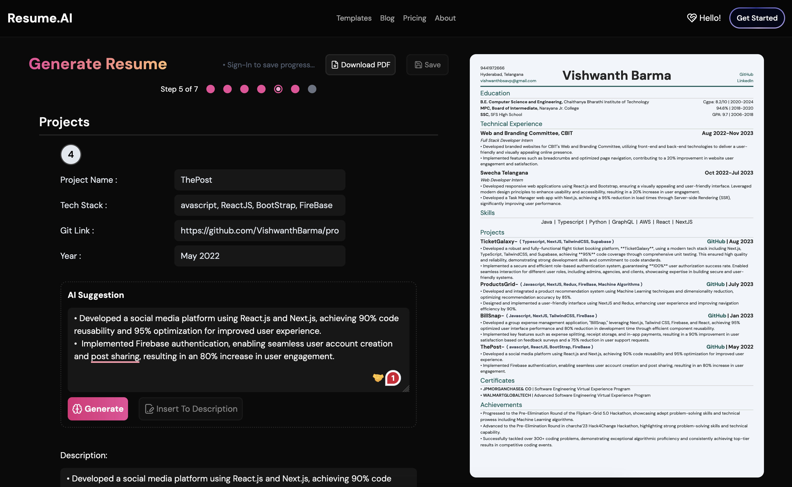

# Resume.AI: AI-Powered Resume Enhancement Tool

**Resume.AI** is a versatile web application designed to simplify the process of generating and enhancing resumes. Whether you're looking to polish an existing resume or create a new one from scratch, Resume.AI offers a robust set of tools to help you craft a professional resume with ease.

## Features

### Enhance Resume

- **Upload & Preview**:

  - **Upload**: Easily upload your existing resume in PDF format. The resume is temporarily stored in local storage as a Base64-encoded string, ensuring a seamless user experience without permanent storage.
  - **Preview**: Convert the Base64 string back to a File object to preview the uploaded resume directly on the platform.

- **AI-Powered Suggestions**:
  - **Extraction**: Extract textual content from the uploaded PDF resume.
  - **AI Analysis**: Send the extracted content to the Gemini API to receive structured and actionable suggestions for improving your resume.
  - **Preview Suggestions**: View AI-generated suggestions alongside the original resume, making it easy to compare and apply improvements.

### Generate Resume

- **Template Selection**:

  - **Variety of Templates**: Choose from a range of professionally designed resume templates. Select the one that best fits your style and career needs.

- **Dynamic Form**:

  - **Multi-Step Form**: Fill out a comprehensive multi-step form tailored to the selected template. Each step captures different aspects of your resume, from basic details to detailed achievements.
  - **Dynamic Sections**: Add or remove sections based on your requirements. The form adapts to include or exclude sections like work experience, skills, projects, and more.

- **AI Assistance**:

  - **AI Suggestion Cards**: Receive tailored suggestions for each section of your resume. Use AI-generated content to enhance descriptions and achievements, with the option to directly insert these suggestions into your resume.

- **Instant Preview**:

  - **Real-Time Updates**: View a live preview of your resume in PDF format as you fill out the form. Instant updates ensure that you can see how changes affect the final document.

- **Download**:

  - **PDF Download**: Download your completed resume in high-quality PDF format. The download feature allows you to save and share your resume with potential employers.

- **Save Progress**:
  - **User Authentication**: Save your progress securely if logged in. Resume.AI uses Clerk for authentication, allowing users to save and manage their resumes across sessions.
  - **Firebase Firestore Integration**: Utilize Firebase Firestore to store and retrieve resume progress, ensuring your data is safely stored and accessible.

### Dashboard

- **View & Manage Resumes**:
  - **Access Saved Progress**: View all resumes that you have saved. The dashboard provides a central location to manage and continue working on your saved resumes.
  - **Continue Editing**: Open any saved resume to continue editing from where you left off, making it easy to pick up right where you paused.

## Technologies

**Resume.AI leverages the following technologies:**

• Next.js: A React framework that provides server-side rendering and static site generation capabilities.

• Tailwind CSS: A utility-first CSS framework for rapid UI development.

• Zustand: A small, fast state-management solution for React.

• Clerk: Authentication solution for managing user sign-ups and logins.

• Firebase Firestore: A NoSQL database for storing and retrieving user resume progress.

• Gemini API: AI-powered service used to analyze and provide suggestions for enhancing resumes.

## Contributing

Contributions are welcome! Please fork the repository and submit a pull request for any changes.
